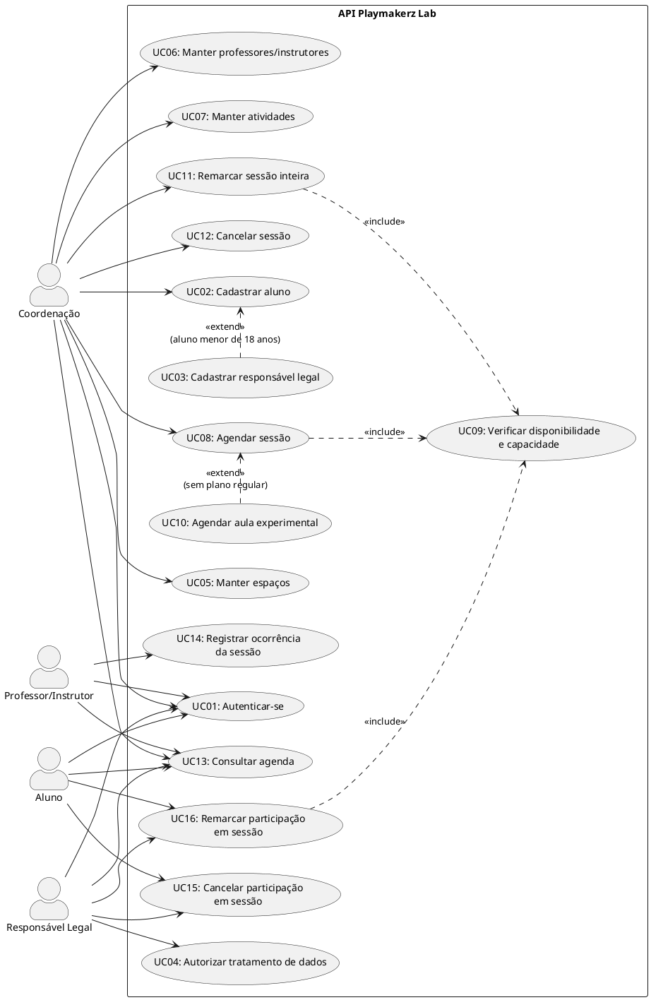

## Introdução

Casos de uso descrevem, do ponto de vista de quem usa o sistema, as interações necessárias para atingir um objetivo. Neste documento são identificados os atores e os casos de uso da API de agendamento da Playmakerz Lab, descritos os fluxos principais e alternativos e apresentado o diagrama de casos de uso. O documento serve de base para o diagrama de classes, para o protótipo de baixa fidelidade e para os diagramas de sequência.

## Metodologia

Os casos de uso foram derivados dos requisitos elicitados no [Brainstorm](../Iniciacao/Brainstorm.md) (BS01 a BS12), do escopo e da legislação registrados na [Pesquisa](../Iniciacao/pesquisa.md) e dos atores identificados no [Mapa Mental](../Iniciacao/mapa_mental.md) e no [Design Thinking](../Iniciacao/design_thinking.md). Cada requisito foi analisado para identificar quem inicia a interação (ator), qual objetivo é atingido (caso de uso) e quais regras de negócio geram fluxos alternativos. O diagrama foi feito em PlantUML, seguindo o modelo de [Levantamento de Requisitos](levreq.md).

## Atores

| Ator | Descrição |
| -- | -- |
| Coordenação | Administra o centro. Tem acesso exclusivo ao cadastro de espaços, profissionais, atividades e alunos, e realiza a alocação das sessões. |
| Professor/Instrutor | Profissional alocado às sessões. Consulta a própria agenda e registra o que ocorreu em cada sessão. |
| Aluno | Pessoa atendida pelo centro, em regime regular ou em aula experimental. Consulta sua agenda e pode solicitar remarcação ou cancelar sua própria participação em uma sessão. |
| Responsável Legal | Responsável pelo aluno menor de 18 anos. Autoriza o tratamento de dados (LGPD), acompanha a agenda e pode solicitar remarcação ou cancelar a participação do aluno vinculado. Pode estar vinculado a mais de um aluno. |

## Lista de Casos de Uso

| ID | Caso de Uso | Ator(es) | Requisito(s) |
| -- | -- | -- | -- |
| UC01 | Autenticar-se | Todos | BS11 |
| UC02 | Cadastrar aluno | Coordenação | BS01 |
| UC03 | Cadastrar responsável legal | Coordenação | BS02 |
| UC04 | Autorizar tratamento de dados do aluno | Responsável Legal | BS02, LGPD |
| UC05 | Manter espaços | Coordenação | BS03 |
| UC06 | Manter professores/instrutores | Coordenação | BS04 |
| UC07 | Manter atividades | Coordenação | BS05 |
| UC08 | Agendar sessão | Coordenação | BS06 |
| UC09 | Verificar disponibilidade e capacidade | (incluído por UC08, UC11 e UC16) | BS07 |
| UC10 | Agendar aula experimental | Coordenação | BS09 |
| UC11 | Remarcar sessão inteira | Coordenação | BS08 |
| UC12 | Cancelar sessão | Coordenação | BS08 |
| UC13 | Consultar agenda | Todos | BS10 |
| UC14 | Registrar ocorrência da sessão | Professor/Instrutor | BS12, Lei 9.696/1998 |
| UC15 | Cancelar participação em sessão | Aluno, Responsável Legal | BS08 |
| UC16 | Remarcar participação em sessão | Aluno, Responsável Legal | BS08 |

## Diagrama de Casos de Uso

### Versão 1.0

## Descrição dos Casos de Uso

### UC01 - Autenticar-se

- **Atores:** Coordenação, Professor/Instrutor, Aluno, Responsável Legal.
- **Pré-condição:** Usuário cadastrado no sistema.
- **Fluxo Principal:**
    1. Usuário envia e-mail e senha.
    2. Sistema valida as credenciais.
    3. Sistema retorna um token de acesso com o perfil do usuário.
- **Fluxos Alternativos:**
    - **FA1:** Credenciais inválidas → Sistema recusa o acesso e informa o erro.
- **Pós-condição:** Usuário autenticado, com acesso restrito às operações do seu perfil.

### UC02 - Cadastrar aluno

- **Atores:** Coordenação.
- **Pré-condição:** Coordenação autenticada.
- **Fluxo Principal:**
    1. Coordenação informa nome, data de nascimento e dados de contato do aluno.
    2. Sistema valida os dados.
    3. Sistema calcula a idade do aluno a partir da data de nascimento.
    4. Sistema registra o aluno.
- **Fluxos Alternativos:**
    - **FA1:** Dados obrigatórios ausentes ou inválidos → Sistema recusa o cadastro e indica os campos com erro.
    - **FA2:** Aluno menor de 18 anos → Sistema executa o UC03 e mantém o aluno bloqueado para agendamento até a autorização do responsável (UC04).
- **Pós-condição:** Aluno cadastrado; se menor de idade, vinculado a um responsável legal.

### UC03 - Cadastrar responsável legal

- **Atores:** Coordenação.
- **Pré-condição:** Aluno menor de 18 anos em cadastro (extensão do UC02).
- **Fluxo Principal:**
    1. Coordenação informa os dados do responsável legal ou seleciona um responsável já cadastrado.
    2. Sistema valida os dados.
    3. Sistema vincula o responsável ao aluno.
- **Fluxos Alternativos:**
    - **FA1:** Responsável já cadastrado → Sistema apenas cria o novo vínculo, permitindo um responsável com mais de um aluno.
    - **FA2:** Dados inválidos → Sistema recusa o cadastro e indica os campos com erro.
- **Pós-condição:** Responsável vinculado ao aluno, com autorização pendente.

### UC04 - Autorizar tratamento de dados do aluno

- **Atores:** Responsável Legal.
- **Pré-condição:** Responsável autenticado e vinculado ao aluno.
- **Fluxo Principal:**
    1. Responsável consulta o termo de consentimento do aluno.
    2. Responsável confirma a autorização.
    3. Sistema registra a autorização com data e hora.
    4. Sistema libera o aluno para agendamentos.
- **Fluxos Alternativos:**
    - **FA1:** Responsável não é vinculado ao aluno → Sistema recusa a operação.
    - **FA2:** Responsável revoga a autorização → Sistema registra a revogação e bloqueia novos agendamentos do aluno.
- **Pós-condição:** Consentimento registrado conforme a LGPD e o ECA.

### UC05 - Manter espaços

- **Atores:** Coordenação.
- **Pré-condição:** Coordenação autenticada.
- **Fluxo Principal:**
    1. Coordenação informa nome e capacidade do espaço.
    2. Sistema valida os dados.
    3. Sistema registra ou atualiza o espaço.
- **Fluxos Alternativos:**
    - **FA1:** Capacidade menor ou igual a zero, ou nome duplicado → Sistema recusa a operação.
    - **FA2:** Usuário sem perfil de coordenação → Sistema recusa o acesso.
    - **FA3:** Redução de capacidade abaixo do número de alunos de sessões futuras → Sistema recusa a alteração e lista as sessões afetadas.
- **Pós-condição:** Espaço disponível para alocação.

### UC06 - Manter professores/instrutores

- **Atores:** Coordenação.
- **Pré-condição:** Coordenação autenticada.
- **Fluxo Principal:**
    1. Coordenação informa nome, contato, especialidades e disponibilidades (dias e faixas de horário) do profissional.
    2. Sistema valida os dados.
    3. Sistema registra ou atualiza o profissional.
- **Fluxos Alternativos:**
    - **FA1:** Faixa de disponibilidade inválida (horário final antes do inicial) → Sistema recusa a operação.
    - **FA2:** Usuário sem perfil de coordenação → Sistema recusa o acesso.
- **Pós-condição:** Profissional disponível para ser vinculado a atividades e sessões.

### UC07 - Manter atividades

- **Atores:** Coordenação.
- **Pré-condição:** Coordenação autenticada; espaços e profissionais cadastrados.
- **Fluxo Principal:**
    1. Coordenação informa nome, duração e modalidade da atividade.
    2. Coordenação vincula os profissionais habilitados e os espaços adequados.
    3. Sistema valida os dados e os vínculos.
    4. Sistema registra ou atualiza a atividade.
- **Fluxos Alternativos:**
    - **FA1:** Profissional ou espaço inexistente → Sistema recusa o vínculo.
    - **FA2:** Duração inválida → Sistema recusa a operação.
- **Pós-condição:** Atividade disponível para agendamento.

### UC08 - Agendar sessão

- **Atores:** Coordenação.
- **Pré-condição:** Coordenação autenticada; atividade, espaço, profissional e alunos cadastrados.
- **Fluxo Principal:**
    1. Coordenação informa data, horário inicial e final, atividade, espaço, profissional e alunos da sessão.
    2. Sistema executa o UC09 (verificar disponibilidade e capacidade).
    3. Sistema registra a sessão com situação "agendada".
    4. Sistema retorna os dados da sessão confirmada.
- **Fluxos Alternativos:**
    - **FA1:** Alguma verificação do UC09 falha → Sistema recusa o agendamento e informa o motivo.
    - **FA2:** Profissional não habilitado para a atividade, ou espaço não adequado → Sistema recusa o agendamento.
    - **FA3:** Aluno menor sem autorização do responsável → Sistema recusa a inclusão do aluno.
- **Pós-condição:** Sessão agendada e visível nas agendas do espaço, do profissional e dos alunos.

### UC09 - Verificar disponibilidade e capacidade

- **Atores:** Sistema (incluído por UC08, UC11 e UC16).
- **Pré-condição:** Dados da sessão informados.
- **Fluxo Principal:**
    1. Sistema verifica se o espaço não tem outra sessão no mesmo intervalo.
    2. Sistema verifica se o profissional não tem outra sessão no mesmo intervalo e se o horário está dentro da sua disponibilidade.
    3. Sistema verifica se o número de alunos não excede a capacidade do espaço.
    4. Sistema confirma que não há conflito.
- **Fluxos Alternativos:**
    - **FA1:** Espaço ocupado → Sistema retorna conflito de espaço.
    - **FA2:** Profissional ocupado ou indisponível → Sistema retorna conflito de profissional.
    - **FA3:** Capacidade excedida → Sistema retorna conflito de capacidade.
- **Pós-condição:** Resultado da verificação retornado ao caso de uso que o incluiu.

### UC10 - Agendar aula experimental

- **Atores:** Coordenação.
- **Pré-condição:** Coordenação autenticada; aluno cadastrado (sem necessidade de plano regular).
- **Fluxo Principal:**
    1. Coordenação indica que a sessão é uma aula experimental.
    2. Sistema segue o fluxo do UC08, aplicando as mesmas regras de disponibilidade e capacidade.
    3. Sistema registra a sessão como aula experimental.
- **Fluxos Alternativos:**
    - **FA1:** Mesmos fluxos alternativos do UC08.
- **Pós-condição:** Aula experimental agendada.

### UC11 - Remarcar sessão inteira

- **Atores:** Coordenação.
- **Pré-condição:** Usuário autenticado; sessão agendada e ainda não realizada.
- **Fluxo Principal:**
    1. Coordenação seleciona a sessão e informa a nova data/horário e o motivo.
    2. Sistema verifica a antecedência mínima.
    3. Sistema executa o UC09 para o novo horário.
    4. Sistema atualiza o horário da sessão inteira, incluindo todos os participantes, libera o horário anterior e registra a alteração no histórico.
- **Fluxos Alternativos:**
    - **FA1:** Sessão já realizada → Sistema recusa a remarcação.
    - **FA2:** Fora da antecedência mínima → Sistema recusa a remarcação.
    - **FA3:** Conflito no novo horário (UC09) → Sistema recusa a remarcação e mantém o horário original.
    - **FA4:** Usuário sem perfil de coordenação → Sistema recusa o acesso.
- **Pós-condição:** Sessão inteira remarcada, com todos os participantes mantidos e histórico da alteração.

### UC12 - Cancelar sessão

- **Atores:** Coordenação.
- **Pré-condição:** Usuário autenticado; sessão agendada e ainda não realizada.
- **Fluxo Principal:**
    1. Coordenação seleciona a sessão inteira e informa o motivo do cancelamento.
    2. Sistema verifica a antecedência mínima.
    3. Sistema altera a situação da sessão para "cancelada" e libera o espaço e o profissional.
    4. Sistema registra a alteração no histórico.
- **Fluxos Alternativos:**
    - **FA1:** Sessão já realizada → Sistema recusa o cancelamento.
    - **FA2:** Fora da antecedência mínima → Sistema recusa o cancelamento.
    - **FA3:** Usuário sem perfil de coordenação → Sistema recusa o acesso.
- **Pós-condição:** Sessão inteira cancelada, recursos liberados e histórico mantido.

### UC13 - Consultar agenda

- **Atores:** Coordenação, Professor/Instrutor, Aluno, Responsável Legal.
- **Pré-condição:** Usuário autenticado.
- **Fluxo Principal:**
    1. Usuário solicita a agenda, opcionalmente com filtros de data, atividade e espaço.
    2. Sistema identifica o perfil e restringe o resultado: aluno vê suas sessões, responsável vê as sessões dos alunos vinculados, professor vê as sessões em que está alocado e coordenação vê todas (por espaço, profissional ou aluno).
    3. Sistema retorna as sessões com data, horário, atividade, professor, espaço, alunos (para professor e coordenação), situação e histórico de alterações.
- **Fluxos Alternativos:**
    - **FA1:** Nenhuma sessão encontrada → Sistema retorna lista vazia.
    - **FA2:** Filtro inválido (ex.: data final antes da inicial) → Sistema recusa a consulta.
- **Pós-condição:** Nenhuma alteração nos dados.

### UC14 - Registrar ocorrência da sessão

- **Atores:** Professor/Instrutor.
- **Pré-condição:** Professor autenticado e alocado à sessão; sessão iniciada ou encerrada.
- **Fluxo Principal:**
    1. Professor seleciona a sessão.
    2. Professor informa a presença individual de cada aluno participante e as observações da sessão.
    3. Sistema registra a ocorrência vinculada ao professor.
    4. Sistema altera a situação da sessão para "realizada".
- **Fluxos Alternativos:**
    - **FA1:** Professor não alocado à sessão → Sistema recusa o registro.
    - **FA2:** Sessão cancelada ou ainda não iniciada → Sistema recusa o registro.
- **Pós-condição:** Sessão realizada, com observações e presença de cada aluno registradas e ocorrência vinculada ao profissional responsável (Lei 9.696/1998).

### UC15 - Cancelar participação em sessão

- **Atores:** Aluno, Responsável Legal.
- **Pré-condição:** Usuário autenticado; sessão agendada e ainda não realizada; aluno participante da sessão.
- **Fluxo Principal:**
    1. Aluno seleciona a própria participação, ou responsável seleciona a participação de aluno vinculado, e informa o motivo.
    2. Sistema verifica a antecedência mínima e o vínculo do usuário com o aluno.
    3. Sistema marca somente a participação como cancelada e libera a vaga do aluno; a sessão continua agendada para os demais participantes.
    4. Sistema registra a alteração no histórico da sessão.
- **Fluxos Alternativos:**
    - **FA1:** Sessão já realizada ou cancelada → Sistema recusa a operação.
    - **FA2:** Fora da antecedência mínima → Sistema recusa a operação.
    - **FA3:** Responsável não vinculado ao aluno, ou aluno não participante → Sistema recusa o acesso.
- **Pós-condição:** Somente a participação solicitada é cancelada; a sessão e os demais participantes permanecem inalterados.

### UC16 - Remarcar participação em sessão

- **Atores:** Aluno, Responsável Legal.
- **Pré-condição:** Usuário autenticado; participação ativa em uma sessão de origem agendada e ainda não realizada; sessão de destino agendada, futura e não cancelada.
- **Fluxo Principal:**
    1. Aluno seleciona a própria participação, ou responsável seleciona a participação de aluno vinculado, e escolhe outra sessão já agendada da mesma atividade.
    2. Sistema verifica a antecedência mínima e o vínculo do usuário com o aluno.
    3. Sistema executa o UC09 para confirmar a vaga e a capacidade da sessão de destino.
    4. Sistema confirma que o aluno não tem outra sessão no mesmo intervalo.
    5. Sistema transfere somente a participação selecionada para a sessão de destino e registra a alteração no histórico da sessão de origem.
- **Fluxos Alternativos:**
    - **FA1:** Sessão de origem já realizada ou sessão de destino realizada ou cancelada → Sistema recusa a remarcação.
    - **FA2:** Fora da antecedência mínima → Sistema recusa a remarcação.
    - **FA3:** Sessão de destino sem vaga ou incompatível com a atividade → Sistema recusa a remarcação e mantém a participação original.
    - **FA4:** Responsável sem vínculo com o aluno, aluno sem participação na sessão de origem ou aluno com outra sessão no mesmo intervalo → Sistema recusa a operação.
- **Pós-condição:** Somente a participação selecionada passa para a sessão de destino; os demais participantes e horários permanecem inalterados e o histórico é mantido.

## Conclusão

A elaboração dos casos de uso transformou os requisitos elicitados no brainstorm em interações concretas entre os atores e a API, deixando explícitas as regras de negócio que geram fluxos alternativos, como a verificação de conflito de espaço, profissional e capacidade, a autorização do responsável para alunos menores e as restrições de cancelamento e remarcação. Esses casos de uso servem de base para o diagrama de classes, o protótipo de baixa fidelidade e os diagramas de sequência.

## Referências

> BEZERRA, E. Princípios de Análise e Projeto de Sistemas com UML. 3. ed. Rio de Janeiro: Elsevier, 2015.

> PlantUML Use Case Diagram. Disponível em: https://plantuml.com/use-case-diagram

> Levantamento de Requisitos e Caso de Uso. Disponível em: https://jonh-carvalho.github.io/PBE_26.2_8002/Elaboracao/levreq/

## Autor(es)

| Data | Versão | Descrição | Autor(es) |
| -- | -- | -- | -- |
| 26/09/2026 | 1.0 | Criação do documento com atores, casos de uso, fluxos e diagrama | Lucas Santos |
| 29/09/2026 | 1.1 | Revisão dos atores e regras de cancelamento; inclusão do UC15 | Pedro Lucas |
