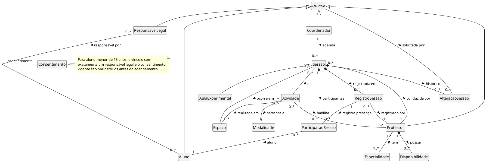

## Introdução

O Diagrama de Classes representa as classes do domínio e os relacionamentos entre elas, servindo de base para a modelagem orientada a objetos e para a implementação do sistema. Nesta fase de Elaboração é apresentado o Diagrama de Classes Conceitual da API da Playmakerz Lab, com as classes vazias, ou seja, sem atributos e métodos, focando nos conceitos do domínio, nos relacionamentos e nas multiplicidades. A evolução para o Diagrama de Classes de Especificação, com atributos, tipos e operações, fica para as próximas fases.

## Metodologia

As classes foram identificadas a partir dos substantivos e responsabilidades presentes nos [Casos de Uso](casos_de_uso.md) (UC01 a UC15), nos requisitos do [Brainstorm](../Iniciacao/Brainstorm.md) (BS01 a BS12) e na [Pesquisa](../Iniciacao/pesquisa.md). Em seguida foram definidos os relacionamentos (associação, composição e generalização) e as multiplicidades de acordo com as regras de negócio descritas nos fluxos principais e alternativos. Classes técnicas (controllers, repositórios, serializers) não foram incluídas. O diagrama foi feito em PlantUML.

## Diagrama de Classes Conceitual

### Versão 1.0

## Descrição das Classes

| Classe | Descrição |
| -- | -- |
| Usuario | Generalização abstrata de quem acessa a API. Concentra a identificação e a autenticação (UC01). |
| Coordenador | Usuário da coordenação do centro. Mantém cadastros e agenda sessões. |
| Professor | Professor/instrutor alocado às sessões e habilitado a conduzir atividades. |
| Aluno | Pessoa atendida pelo centro, em regime regular ou em aula experimental. |
| ResponsavelLegal | Responsável pelo aluno menor de 18 anos. Pode estar vinculado a mais de um aluno. |
| Consentimento | Classe de associação entre responsável e aluno que registra a autorização (ou revogação) do tratamento de dados, conforme a LGPD e o ECA. |
| Disponibilidade | Dia e faixa de horário em que o professor pode ser alocado. Existe apenas vinculada ao professor (composição). |
| Especialidade | Área de atuação do professor (ex.: preparação física, fisioterapia esportiva). |
| Modalidade | Categoria da atividade (ex.: funcional, força, avaliação física). |
| Atividade | Tipo de treino oferecido, com duração, vinculado aos professores habilitados e aos espaços adequados. |
| Espaco | Sala ou área do centro, com capacidade máxima. |
| Sessao | Ocorrência agendada de uma atividade, com data, horário, espaço, professor e alunos. É o centro da verificação de conflito. |
| AulaExperimental | Especialização de sessão para alunos sem plano regular, sujeita às mesmas regras de disponibilidade e capacidade. |
| AlteracaoSessao | Registro de cancelamento ou remarcação, com motivo e autor, compondo o histórico da sessão. |
| RegistroSessao | Registro do que ocorreu na sessão (presença e observações), vinculado ao professor responsável (Lei 9.696/1998). |
| ParticipacaoSessao | Vínculo de um aluno com uma sessão, com situação da participação e presença individual registrada em sua ocorrência. |

## Relacionamentos e Multiplicidades

| Relacionamento | Multiplicidade | Justificativa |
| -- | -- | -- |
| ResponsavelLegal — Aluno | 0..* para 0..* | Adultos podem não ter responsável; um responsável pode estar vinculado a vários alunos. Para menores, é obrigatório exatamente um vínculo e consentimento vigente antes do agendamento (BS02). |
| Professor ◆ Disponibilidade | 1 para 0..* | Disponibilidade só existe vinculada a um professor (BS04). |
| Professor — Especialidade | 0..* para 1..* | Todo professor tem ao menos uma especialidade (BS04). |
| Atividade — Modalidade | 0..* para 1 | Cada atividade pertence a uma modalidade (BS05). |
| Atividade — Professor | 0..* para 1..* | Toda atividade tem ao menos um profissional habilitado (BS05). |
| Atividade — Espaco | 0..* para 1..* | Toda atividade tem ao menos um espaço adequado (BS05). |
| Sessao — Atividade / Espaco / Professor | 0..* para 1 | Cada sessão tem exatamente uma atividade, um espaço e um profissional (BS06). |
| Sessao — ParticipacaoSessao — Aluno | Sessão 1 para 0..* participações; cada participação liga 1 sessão a 1 aluno | A presença e a situação são registradas por aluno, e não apenas no nível da sessão; participantes ativos são limitados pela capacidade do espaço (BS07, BS12). |
| Sessao ◆ AlteracaoSessao | 1 para 0..* | O histórico de alterações pertence à sessão (BS08). |
| Sessao ◆ RegistroSessao | 1 para 0..1 | Uma sessão realizada tem um registro de ocorrência (UC14). |

## Rastreabilidade

As classes `Coordenador`, `Professor`, `Aluno` e `ResponsavelLegal` herdam de `Usuario`; por isso, todas se relacionam com a autenticação e o controle de acesso do BS11 e do UC01, registrados na linha de `Usuario`.

| Classe Conceitual | Requisito(s) | Caso(s) de Uso |
| -- | -- | -- |
| Usuario | BS11 | UC01 |
| Coordenador | BS01, BS02, BS03, BS04, BS05, BS06, BS08, BS09, BS10 | UC02, UC03, UC05, UC06, UC07, UC08, UC10, UC11, UC12, UC13 |
| Professor | BS04, BS10, BS12 | UC06, UC08, UC13, UC14 |
| Aluno | BS01, BS02, BS06, BS08, BS10, BS12 | UC02, UC08, UC11, UC13, UC14, UC15 |
| ResponsavelLegal | BS02, BS08, BS10, BS11 | UC01, UC03, UC04, UC11, UC13, UC15 |
| Consentimento | BS02 | UC03, UC04, UC08 |
| Disponibilidade | BS04, BS07 | UC06, UC09 |
| Especialidade | BS04, BS05 | UC06, UC07 |
| Modalidade | BS05 | UC07 |
| Atividade | BS05, BS06, BS09 | UC07, UC08, UC10 |
| Espaco | BS03, BS05, BS06, BS07, BS09 | UC05, UC07, UC08, UC09, UC10, UC11, UC12, UC13 |
| Sessao | BS06, BS07, BS08, BS09, BS10, BS12 | UC08, UC09, UC10, UC11, UC12, UC13, UC14, UC15 |
| AulaExperimental | BS09 | UC10 |
| AlteracaoSessao | BS08 | UC11, UC12, UC15 |
| RegistroSessao | BS12, Lei 9.696/1998 | UC14 |
| ParticipacaoSessao | BS06, BS07, BS08, BS12 | UC08, UC14, UC15 |

## Conclusão

O diagrama de classes conceitual consolidou os conceitos do domínio da Playmakerz Lab identificados nos casos de uso, deixando explícito que a Sessão é o elemento central do sistema, ligando atividade, espaço, professor e alunos, e sobre ela recaem as regras de conflito e capacidade. As multiplicidades traduzem as regras de negócio levantadas no brainstorm e a tabela de rastreabilidade garante que cada classe tem origem em ao menos um requisito e caso de uso. Na próxima fase o modelo será refinado para o Diagrama de Classes de Especificação, com atributos, tipos e operações.

## Referências

> BEZERRA, E. Princípios de Análise e Projeto de Sistemas com UML. 3. ed. Rio de Janeiro: Elsevier, 2015.

> PlantUML Class Diagram. Disponível em: https://plantuml.com/class-diagram

## Autor(es)

| Data | Versão | Descrição | Autor(es) |
| -- | -- | -- | -- |
| 26/09/2026 | 1.0 | Criação do diagrama de classes conceitual | Lucas Santos |
| 29/09/2026 | 1.1 | Inclusão da participação e presença individual, revisão das restrições e Rastreabilidade | Pedro Lucas |
