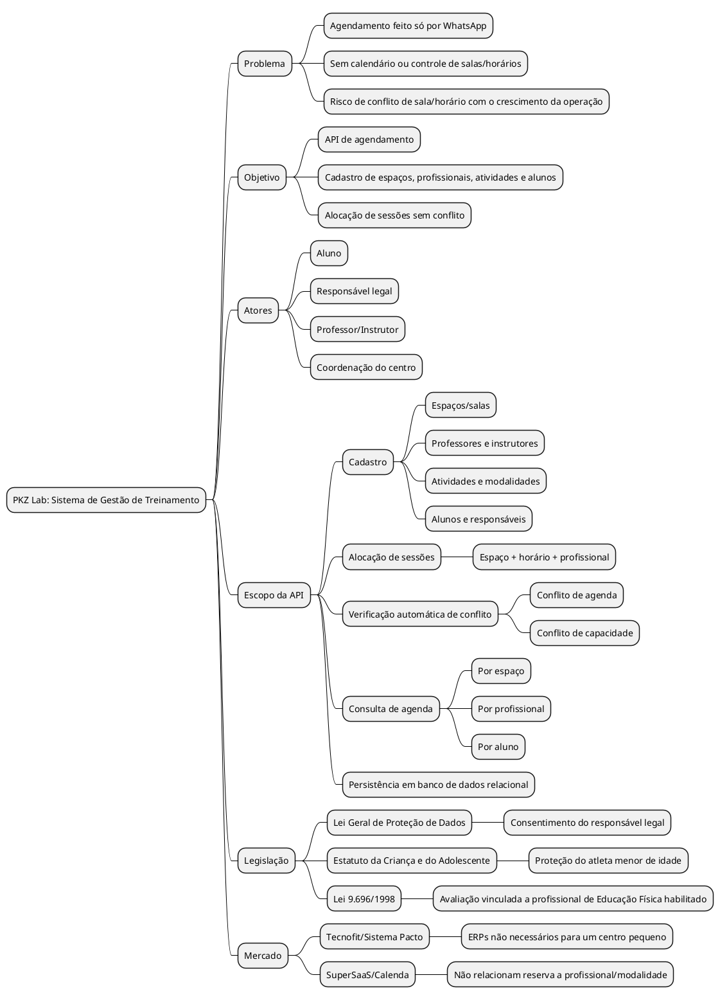
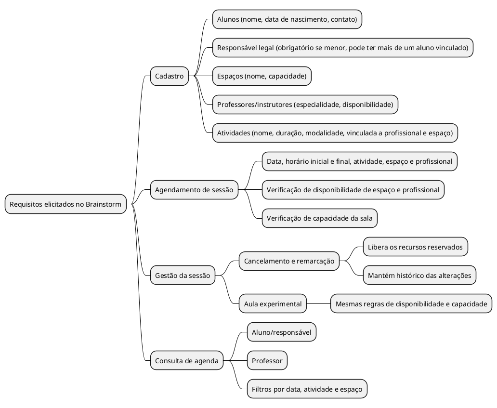

## Introdução

Mapa mental consiste em criar resumos cheios de símbolos, cores, setas e frases de efeito com o objetivo de organizar o conteúdo e facilitar associações entre as informações destacadas. Esse material é muito indicado para pessoas que têm facilidade de aprender de forma visual.

## Metodologia

O documento foi elaborado por Pedro Lucas, com base no levantamento já registrado em <a href="pesquisa.md">pesquisa.md</a> e nos requisitos elicitados em <a href="Brainstorm.md">Brainstorm.md</a>, organizando o projeto PKZ Lab em dois mapas mentais feitos em PlantUML.

## Mapa mental - Geral

### Mapa mental 1

### Mapa mental 2

## Conclusão

O mapa mental 1 organizou visualmente o problema do PKZ Lab (agendamento só via WhatsApp), o objetivo da API, os atores envolvidos, o escopo do sistema, a legislação aplicável e o comparativo ao mercado. O mapa mental 2 organizou os requisitos elicitados na sessão de Brainstorm, agrupados por cadastro, agendamento de sessão, gestão da sessão e consulta de agenda. Juntos, servem de base para o levantamento de requisitos.

## Referências
> PlantUML Mindmap Diagram. Disponível em: https://plantuml.com/mindmap-diagram

## Versionamento
| Data | Versão | Descrição | Autor(es) |
| -- | -- | -- | -- |
| 08/09/26 | 1.0 | Criação do documento | Pedro Lucas |
