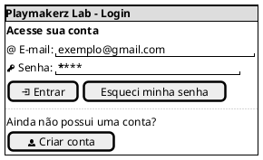
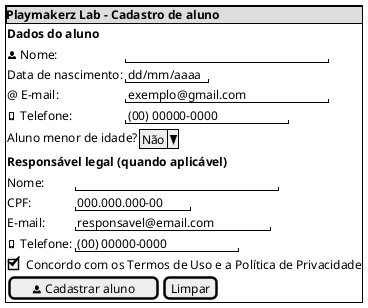
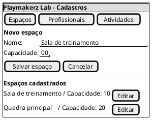
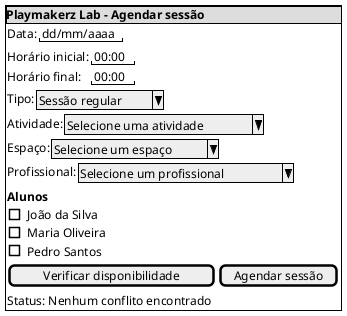
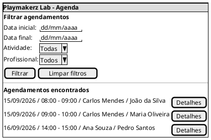
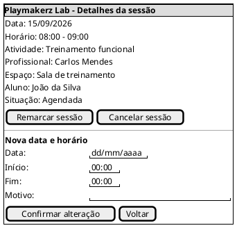

## Introdução

O protótipo de baixa fidelidade é uma representação simples e rápida da solução, usada para validar telas, navegação e funcionalidades antes da implementação. As telas são representadas em PlantUML Salt, destacando campos, filtros, informações e ações principais para os perfis do sistema. O protótipo serve de base para os casos de uso, o diagrama de classes e a implementação em Django.

## Metodologia

A equipe definiu as telas a partir dos requisitos elicitados no [Brainstorm](Brainstorm.md) (BS01 a BS10) e do escopo da [Pesquisa](pesquisa.md), priorizando o que é central para o problema da Playmakerz Lab: autenticação, cadastro de aluno e responsável, manutenção de cadastros, agendamento, cancelamento, remarcação e consulta de agenda. Para cada tela foram identificados os campos, filtros, informações exibidas e ações disponíveis para cada perfil. Os protótipos foram desenhados em PlantUML Salt para validar a organização das informações e a navegação prevista antes da implementação.

## Protótipo de Baixa Fidelidade

### Versão 1.0

### Telas representadas

| Tela | Descrição | Requisito(s) |
| -- | -- | -- |
| 1. Login | Acesso à conta conforme o perfil do usuário | BS03 |
| 2. Cadastro de aluno e responsável | Inclusão dos dados do aluno e do responsável legal quando necessário | BS01, BS02 |
| 3. Cadastros da coordenação | Manutenção de espaços, profissionais e atividades | BS03, BS04, BS05 |
| 4. Agendamento de sessão | Seleção de data, horário, atividade, espaço, profissional e alunos | BS06, BS07, BS09 |
| 5. Consulta de agenda | Visualização de sessões com filtros e acesso aos detalhes | BS10 |
| 6. Cancelamento ou remarcação | Visualização dos detalhes e alteração de uma sessão | BS08 |

### Protótipos de baixa fidelidade

Os protótipos abaixo representam as telas principais do sistema em PlantUML
Salt. Os campos, filtros, informações e botões indicam as interações previstas
para cada perfil de usuário.

#### Tela 1: Login

#### Tela 2: Cadastro de aluno e responsável

#### Tela 3: Cadastros da coordenação

#### Tela 4: Agendamento de sessão

#### Tela 5: Consulta de agenda

#### Tela 6:  Cancelamento ou remarcação

## Conclusão

A elaboração do protótipo de baixa fidelidade permitiu visualizar, antes da implementação, a organização das telas, os campos necessários, as ações disponíveis e a navegação principal da Playmakerz Lab. Os protótipos destacam regras importantes do sistema, como a exigência de consentimento para alunos menores, a seleção de recursos no agendamento e a possibilidade de consultar, cancelar ou remarcar sessões. O material serve de referência para os casos de uso, o diagrama de classes e a construção da aplicação.

## Referências

> PlantUML Salt. Disponível em: https://plantuml.com/salt

> Protótipo de Baixa Fidelidade. Disponível em: https://jonh-carvalho.github.io/PECDII_26.2_8001/Iniciacao/prototipo_baixa_fidelidade/

## Autor(es)

| Data | Versão | Descrição | Autor(es) |
| -- | -- | -- | -- |
| 26/09/2026 | 1.0 | Criação do protótipo de baixa fidelidade | Lucas Santos |
| 04/10/2026 | 2.0 | Inclusão e organização dos protótipos de telas em PlantUML Salt | Pedro Lucas |