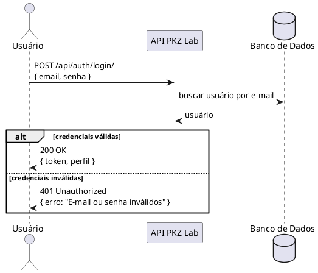
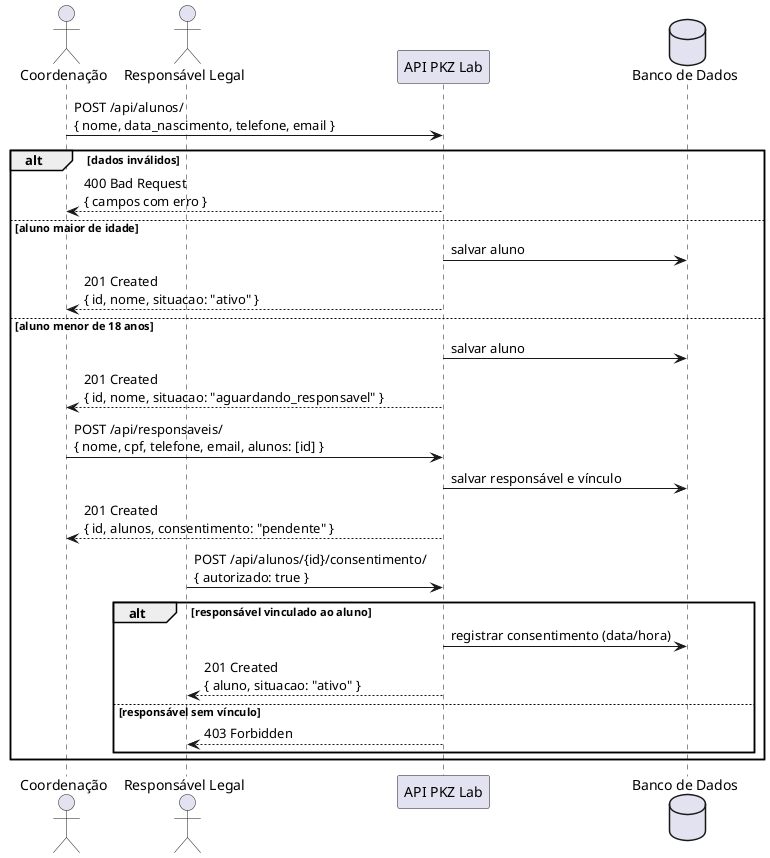
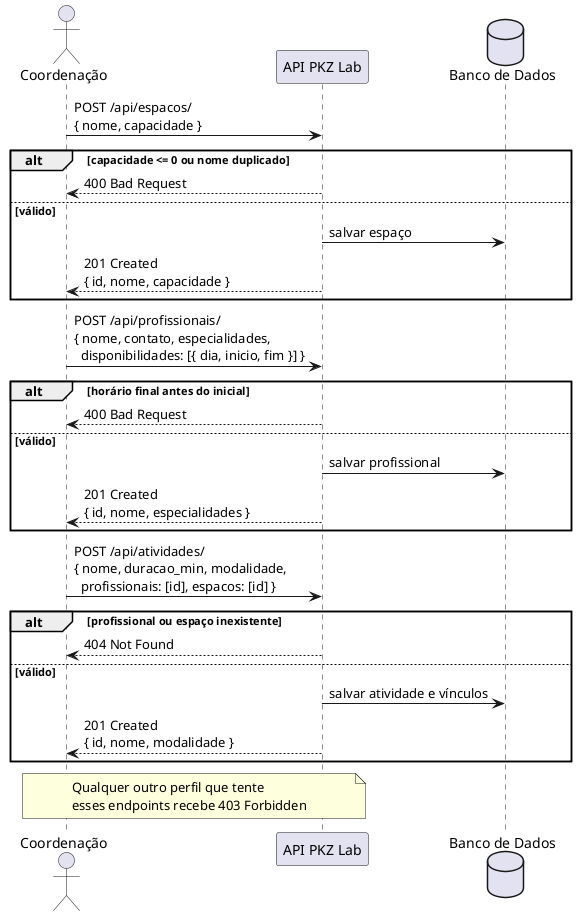
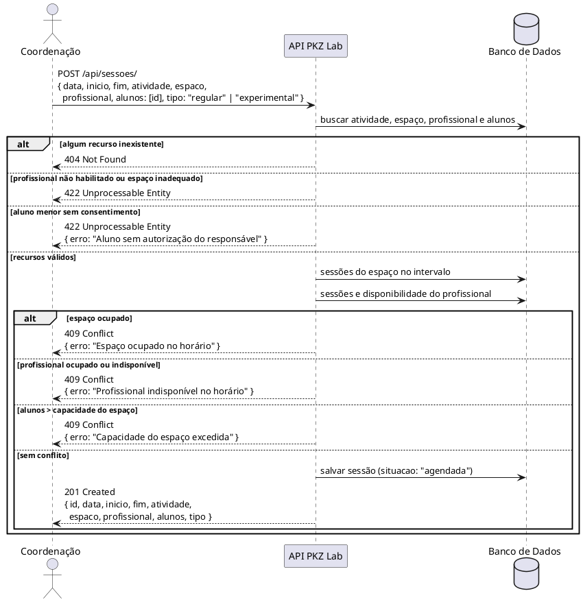
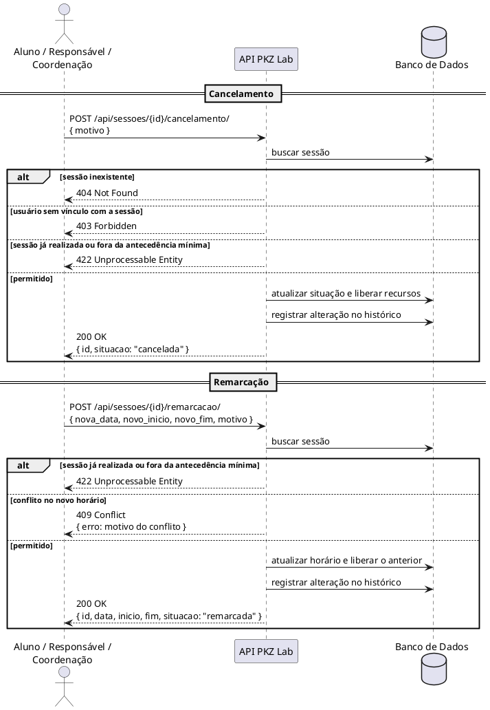
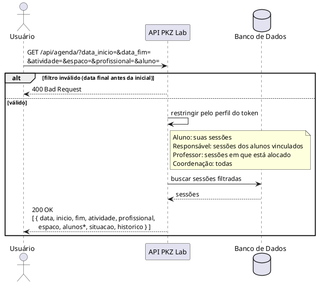

## Introdução

O protótipo de baixa fidelidade é uma representação simples e rápida da solução, usada para validar fluxos e funcionalidades antes da implementação. Como o sistema da PKZ Lab é unicamente back-end, o protótipo não representa telas, e sim a API: quais endpoints existem, o que cada request recebe, o que responde e quais erros podem acontecer. Ele serve de base para os casos de uso, para o diagrama de classes e para a implementação em Django.

## Metodologia

A equipe definiu os fluxos a partir dos requisitos elicitados no [Brainstorm](Brainstorm.md) (BS01 a BS10) e do escopo da [Pesquisa](pesquisa.md), priorizando o que é central para o problema da PKZ Lab: cadastro, alocação de sessão sem conflito, cancelamento/remarcação e consulta de agenda. Para cada fluxo foram identificados os endpoints, as entradas, as respostas de sucesso e os erros esperados. Os fluxos foram desenhados em PlantUML como diagramas de sequência entre o cliente da API e o sistema, no nível de requests HTTP (sem detalhar classes internas, o que fica para os diagramas de sequência da Elaboração).

## Protótipo de Baixa Fidelidade

### Versão 1.0

### Fluxos representados

| Fluxo | Descrição | Requisito(s) |
| -- | -- | -- |
| 1. Autenticação | Login e obtenção do token de acesso por perfil | BS03 |
| 2. Cadastro de aluno e responsável | Cadastro do aluno, com responsável e consentimento quando menor | BS01, BS02 |
| 3. Cadastros da coordenação | Espaços, professores/instrutores e atividades | BS03, BS04, BS05 |
| 4. Agendamento de sessão | Alocação de espaço + horário + profissional com verificação de conflito e capacidade | BS06, BS07, BS09 |
| 5. Cancelamento e remarcação | Alteração de sessão com histórico | BS08 |
| 6. Consulta de agenda | Agenda por perfil com filtros | BS10 |

### Endpoints principais

| Método | Endpoint | Descrição | Perfil |
| -- | -- | -- | -- |
| POST | `/api/auth/login/` | Autentica o usuário e retorna o token | Todos |
| POST | `/api/alunos/` | Cadastra aluno | Coordenação |
| GET | `/api/alunos/{id}/` | Consulta aluno | Coordenação, Responsável |
| POST | `/api/responsaveis/` | Cadastra responsável legal e vincula a um ou mais alunos | Coordenação |
| POST | `/api/alunos/{id}/consentimento/` | Registra a autorização do responsável (LGPD) | Responsável |
| POST / GET / PUT | `/api/espacos/` | Cadastra, lista e atualiza espaços | Coordenação |
| POST / GET / PUT | `/api/profissionais/` | Cadastra, lista e atualiza professores/instrutores e disponibilidades | Coordenação |
| POST / GET / PUT | `/api/atividades/` | Cadastra, lista e atualiza atividades | Coordenação |
| POST | `/api/sessoes/` | Agenda sessão regular ou aula experimental | Coordenação |
| POST | `/api/sessoes/{id}/remarcacao/` | Remarca sessão | Coordenação, Aluno, Responsável |
| POST | `/api/sessoes/{id}/cancelamento/` | Cancela sessão | Coordenação, Aluno, Responsável |
| POST | `/api/sessoes/{id}/registro/` | Registra presença e observações da sessão | Professor |
| GET | `/api/agenda/` | Consulta agenda com filtros | Todos |

### Respostas e erros padrão

| Código | Quando ocorre |
| -- | -- |
| 200 OK | Consulta ou atualização realizada |
| 201 Created | Recurso criado (cadastro, sessão, alteração) |
| 400 Bad Request | Dados obrigatórios ausentes ou em formato inválido |
| 401 Unauthorized | Token ausente, inválido ou expirado |
| 403 Forbidden | Perfil sem permissão para a operação (ex.: aluno tentando cadastrar espaço) |
| 404 Not Found | Recurso inexistente (aluno, espaço, sessão...) |
| 409 Conflict | Conflito de espaço, de profissional ou de capacidade |
| 422 Unprocessable Entity | Regra de negócio violada (menor sem consentimento, sessão já realizada, fora da antecedência mínima) |

### Fluxo 1 - Autenticação

### Fluxo 2 - Cadastro de aluno e responsável legal

### Fluxo 3 - Cadastros da coordenação (espaço, profissional e atividade)

### Fluxo 4 - Agendamento de sessão com verificação de conflito

### Fluxo 5 - Cancelamento e remarcação de sessão

### Fluxo 6 - Consulta de agenda

\* A lista de alunos da sessão só é retornada para professor e coordenação.

## Conclusão

A elaboração do protótipo de baixa fidelidade permitiu definir, antes da implementação, os endpoints da API da PKZ Lab, o formato das entradas e respostas e os erros esperados em cada fluxo. Isso deixou claras as regras centrais do sistema, como a verificação de conflito de espaço, profissional e capacidade e a exigência de consentimento do responsável para alunos menores, e serve de referência para os casos de uso, o diagrama de classes e a construção da API.

## Referências

> PlantUML Sequence Diagram. Disponível em: https://plantuml.com/sequence-diagram

> MDN Web Docs. HTTP response status codes. Disponível em: https://developer.mozilla.org/pt-BR/docs/Web/HTTP/Status

> Protótipo de Baixa Fidelidade. Disponível em: https://jonh-carvalho.github.io/PECDII_26.2_8001/Iniciacao/prototipo_baixa_fidelidade/

## Autor(es)

| Data | Versão | Descrição | Autor(es) |
| -- | -- | -- | -- |
| 26/09/2026 | 1.0 | Criação do protótipo de baixa fidelidade da API com fluxos, endpoints e erros | Lucas Santos |
